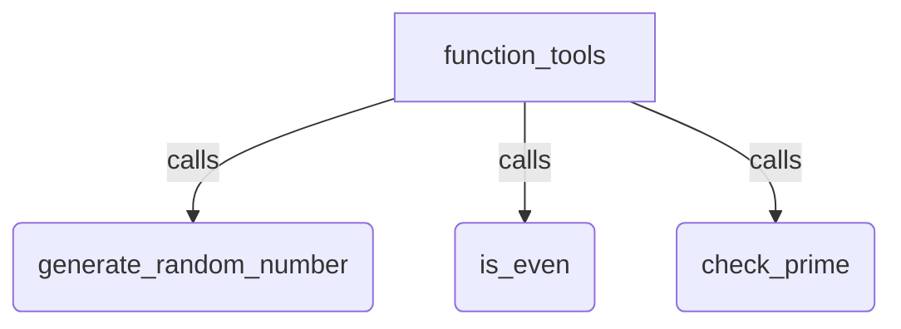

# ADK Agent Function Tools Sample

## Overview

This sample demonstrates how to equip an `Agent` with Python function tools, including both regular functions and generator functions that stream intermediate progress `Event` objects before yielding a final tool output.

It defines three utility functions: `generate_random_number`, `is_even`, and `check_prime`. The LLM automatically invokes these functions based on user prompts, while `check_prime` streams an intermediate progress event during execution.

## Sample Inputs

- `Give me a random number.`

- `Give me a random number up to 50, and tell me if it's even.`

- `Give me a random number and is 44 even?`

  *This causes parallel tools to be called in a single step.*

- `Is 97 a prime number?`

  *Invokes the `check_prime` generator tool, which yields an intermediate progress `Event` before yielding the final primality dictionary.*

## Graph



## How To

1. Define standard Python functions or generator functions with type hints and docstrings:

   ```python
   from collections.abc import Generator
   import random
   from typing import Any
   from google.adk.events import Event

   def generate_random_number(max_value: int = 100) -> int:
       """Generates a random integer between 0 and max_value (inclusive)."""
       return random.randint(0, max_value)

   def is_even(number: int) -> bool:
       """Checks if a given number is even."""
       return number % 2 == 0

   def check_prime(number: int) -> Generator[Event | dict[str, Any], None, None]:
       """Checks whether a number is prime while streaming progress events."""
       yield Event(message=f"Checking whether {number} is a prime number...")
       if number < 2:
           yield {"number": number, "is_prime": False}
           return
       for divisor in range(2, int(number**0.5) + 1):
           if number % divisor == 0:
               yield {"number": number, "is_prime": False, "divisor": divisor}
               return
       yield {"number": number, "is_prime": True}
   ```

1. Register the functions directly in the agent's `tools` list:

   ```python
   from google.adk.agents import Agent

   root_agent = Agent(
       name="function_tools",
       tools=[generate_random_number, is_even, check_prime],
   )
   ```

## Related Guides

- [FunctionTool](../../../../docs/guides/tools/function_tool/index.md) - Explains wrapping Python functions and generators as agent tools with argument validation, progress streaming, and confirmation.
- [Node as tool](../../../../docs/guides/tools/node_tool/index.md) - Explains exposing workflows and configured nodes as agent tools with isolated runtime branching.
