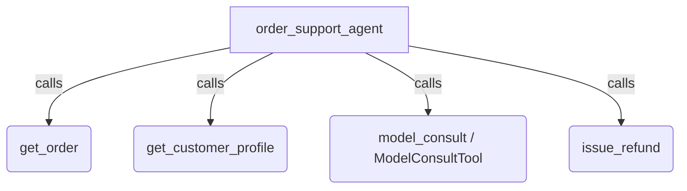

# ADK Model Consult Sample

## Overview

This sample demonstrates how an e-commerce order support assistant, `order_support_agent`, pairs routine lookup and action tools, `get_order`, `get_customer_profile`, and `issue_refund`, with `ModelConsultTool` to escalate multi-rule refund policy decisions to a stronger advisor model mid-generation.

The primary agent gathers order and customer details directly and follows the default escalation policy that `ModelConsultTool` adds to its system instruction: it calls `model_consult` before committing to a refund decision and, on longer tasks, again before declaring the task done. The advisor adds the most value when multiple policy exceptions interact, such as late returns, opened electronics restocking fees, defect bulletins, and Gold-tier loyalty exemptions. The agent then executes `issue_refund` based on the advisor's guidance.

## Sample Inputs

- `Customer CUST-108 wants a full refund to their original payment method for order ORD-502 (wireless headphones bought 45 days ago, opened, battery drains quickly). Check the order and customer profile, process the appropriate refund, and explain the decision.`

  *The agent calls `get_order('ORD-502')` and `get_customer_profile('CUST-108')`, consults `model_consult` to reconcile the 30-day return cutoff against defect bulletin `SB-2026-04` and the customer's Gold-tier loyalty status with a `2.4%` return rate, executes `issue_refund(order_id='ORD-502', method='original_payment', amount_usd=280.0, ...)`, and summarizes the approved refund.*

- `Customer CUST-10 wants to return order ORD-101 (unopened USB-C cable delivered 5 days ago) for a refund.`

  *The agent looks up the order and customer profile and confirms the item is unopened within the 30-day return window. Because the default escalation policy asks the agent to consult before committing to a decision, the agent usually still calls `model_consult` once or twice here, the advisor confirms the straightforward decision, and `max_uses=2` caps the number of consultations in the turn. The agent then processes the full `$19.00` refund to `original_payment`.*

## Graph



## How To

Define your domain tools, `get_order`, `get_customer_profile`, and `issue_refund`, and attach `ModelConsultTool` to the `Agent`:

```python
from google.adk import Agent
from google.adk.tools import ModelConsultTool


def get_order(order_id: str) -> dict[str, str | int | float | bool | None]:
  """Looks up an order by its identifier.

  Args:
    order_id: Order identifier such as 'ORD-101' or 'ORD-502'.

  Returns:
    A dictionary with the order details and any active defect bulletin.
  """
  return {
      "order_id": order_id,
      "price_usd": 280.0,
      "days_since_delivery": 45,
      "opened": True,
      "defect_bulletin": (
          "SB-2026-04: 90-day warranty replacement or store credit; cash refund"
          " past 30 days requires Gold-tier loyalty exemption."
      ),
  }


def get_customer_profile(customer_id: str) -> dict[str, str | int | float]:
  """Looks up a customer's loyalty tier and return history.

  Args:
    customer_id: Customer identifier such as 'CUST-10' or 'CUST-108'.

  Returns:
    A dictionary with the customer's loyalty tier and return rate percentage.
  """
  return {"customer_id": customer_id, "tier": "gold", "return_rate_pct": 2.4}


def issue_refund(
    order_id: str,
    method: str,
    amount_usd: float,
    reason: str,
) -> dict[str, str | float]:
  """Issues a refund or replacement for an order.

  Args:
    order_id: Order identifier being refunded.
    method: One of 'original_payment', 'store_credit', or 'replacement'.
    amount_usd: Dollar amount to refund.
    reason: Short explanation of the policy rule applied.

  Returns:
    A confirmation record for the processed refund.
  """
  return {
      "status": "processed",
      "order_id": order_id,
      "method": method,
      "amount_usd": amount_usd,
      "reason": reason,
  }


root_agent = Agent(
    name="order_support_agent",
    instruction=(
        "You are an e-commerce order support assistant. Look up the order and"
        " customer profile before calling issue_refund, and summarize the"
        " outcome for the customer."
    ),
    tools=[
        get_order,
        get_customer_profile,
        issue_refund,
        ModelConsultTool(
            max_uses=2,
            session_max_uses=5,
            thinking_level="high",
        ),
    ],
)
```

Run the sample interactively from the repository root with the ADK CLI:

```bash
adk run contributing/samples/tools/model_consult
```

Or launch the ADK web UI pointed at `contributing/samples/tools` and select `model_consult`:

```bash
adk web contributing/samples/tools
```

## Related Guides

- [ModelConsultTool and ModelConsultContextConfig](../../../../docs/guides/tools/model_consult/model_consult_tool/index.md) - Escalating hard decisions mid-generation to a stronger advisor model with per-turn and session budgets.
