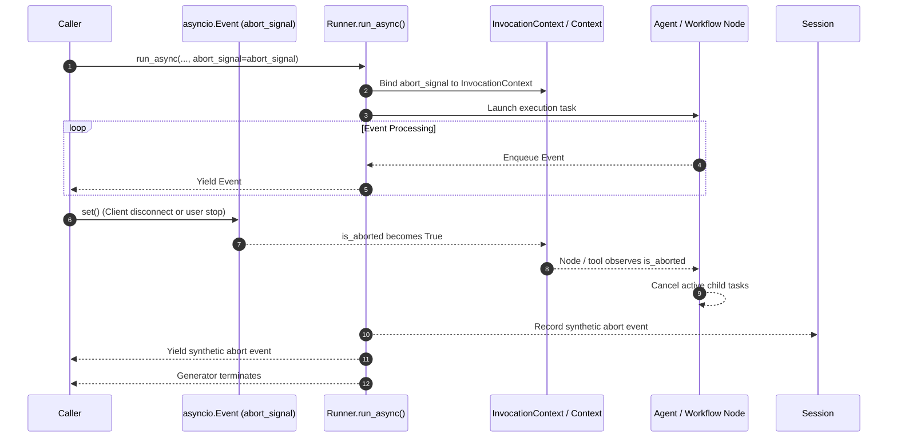

# Runner execution cancellation

`Runner.run_async` accepts an optional `abort_signal` parameter to halt running agent and workflow executions upon client disconnects or manual cancellation requests. When the signal trips, the runner halts execution, cancels active child tasks, and closes the event stream without corrupting session history.

## Introduction

Long-running agent steps, multi-turn tool loops, and parallel workflow graphs consume token quota and compute time. When a web client disconnects from a Server-Sent Events stream, or when an interactive user clicks a stop button in a user interface, continuing execution wastes resources and risks executing side-effecting tools that the user no longer wants.

Python ADK addresses this by integrating standard `asyncio.Event` primitives into `Runner.run_async`. Callers pass an `abort_signal` into the runner. When the signal trips, the runner terminates iteration cleanly, active nodes and tools observe the cancellation, and the async generator finishes without raising unhandled exceptions into caller code.

ADK's built-in API server (`adk api_server`) and development UI (`adk web`) automatically wire this mechanism into the `/run` and `/run_sse` endpoints. When an HTTP client disconnects, closes the browser tab, or aborts the Server-Sent Events stream, the server detects the disconnection and triggers the `abort_signal` automatically—halting the active agent execution and sealing any pending tool calls without requiring custom cancellation code.

## Get started

The following example passes an `asyncio.Event` as an `abort_signal` to `runner.run_async`, allowing the caller to stop generation after receiving the first model response chunk:

```python
import asyncio
from google.adk.agents.llm_agent import LlmAgent
from google.adk.apps import App
from google.adk.runners import InMemoryRunner
from google.genai import types

root_agent = LlmAgent(
    name="researcher",
    instruction="Answer queries with detailed multi-paragraph explanations.",
)

app = App(name="cancellation_app", root_agent=root_agent)
runner = InMemoryRunner(app=app)

abort_signal = asyncio.Event()

# In an async function:
async def run_with_cancellation():
  session = await runner.session_service.create_session(
      app_name=app.name,
      user_id="user_123",
      session_id="session_cancellation",
  )

  async for event in runner.run_async(
      user_id="user_123",
      session_id=session.id,
      new_message=types.Content(
          role="user",
          parts=[types.Part.from_text(text="Generate a lengthy report.")],
      ),
      abort_signal=abort_signal,
  ):
    if event.content and event.content.parts:
      for part in event.content.parts:
        if part.text:
          print("Received chunk:", part.text)
          # Stop generation after receiving initial content
          abort_signal.set()
```

When `abort_signal.set()` is called, the runner detects the set signal on the subsequent event cycle, cancels running background agent tasks, and exits the generator cleanly.

## How it works

Execution cancellation coordinates between `Runner`, the active `InvocationContext`, the root agent or workflow, and any active child tasks:



1. **Signal propagation:** The caller supplies an `asyncio.Event` to `run_async`. The runner passes this event into `InvocationContext`, where child agents, tools, and sub-workflows receive references to it.
1. **Context visibility:** `Context`, `ReadonlyContext`, and `ToolContext` expose the boolean property `is_aborted`. Synchronous tools and cooperative loops inspect this property to exit lengthy computations early.
1. **Workflow task cascades:** In a graph workflow, `Workflow` monitors the abort signal alongside active node tasks. When the signal fires, `Workflow` cancels all pending child task handles and awaits their completion, preventing orphaned background tasks from continuing to run.
1. **Clean generator termination and state sealing:** Unlike exceptions that interrupt normal control flow, the runner handles cancellation through clean loop termination. Events already yielded prior to the abort are retained by the caller, while any events still buffered in the internal queue at the time of cancellation are dropped rather than drained. When an abort occurs during tool execution, the runner seals open tool transactions by appending synthetic function responses for any dangling function calls to session history and yielding them to the caller, preventing unclosed calls from corrupting subsequent turns. If no tool calls are pending, the runner appends an abort event authored by the root agent with an `INVOCATION_ABORTED` error code to session history and yields it to the caller, ending the event stream with an abort event without raising `asyncio.CancelledError`.

## Configuration options

The cancellation mechanism introduces an option on `Runner.run_async` and cancellation primitives on `Context`:

| Option         | Type                    | Default | Description                                                                 |
| :------------- | :---------------------- | :------ | :-------------------------------------------------------------------------- |
| `abort_signal` | `asyncio.Event \| None` | `None`  | An optional event used to request immediate cancellation of the active run. |

The `abort_signal` parameter is passed directly to `runner.run_async`. When set to `None`, the invocation executes without external abort monitoring. When provided, the runner checks the signal before processing each event and propagates the reference throughout the execution context.

The execution context exposes a member for inspecting the signal:

| Member           | Type   | Scope                        | Description                                                   |
| :--------------- | :----- | :--------------------------- | :------------------------------------------------------------ |
| `ctx.is_aborted` | `bool` | `ReadonlyContext`, `Context` | Returns `True` when an abort signal is present and triggered. |

The `ctx.is_aborted` property allows tools and custom nodes to check whether an external abort has been requested. For voluntary termination from within tools or callbacks (as opposed to external cancellation), tools should set `ctx.end_invocation = True`.

## Advanced applications

The following use cases demonstrate how to integrate cancellation into tools and background worker threads.

### Checking cancellation status within a tool

Custom tools can inspect the cancellation status through the execution context:

```python
from google.adk.agents.context import Context

def long_running_processing_tool(steps: int, ctx: Context) -> str:
  for step in range(steps):
    if ctx.is_aborted:
      return "Processing cancelled by user."
    # Perform unit of work
  return f"Completed {steps} steps."
```

Checking `ctx.is_aborted` inside iterative tools avoids continuing processing when an external stop signal has already arrived.

### Cross-thread cancellation from background workers

When running background tasks or listening to external network events in a separate OS thread, signal cancellation to the runner's event loop in a thread-safe manner:

```python
import asyncio
import threading
import time

def wait_for_external_event() -> bool:
  """Simulates blocking I/O that waits for an external stop command."""
  time.sleep(1.0)
  return True

def background_listener(
    loop: asyncio.AbstractEventLoop, abort_signal: asyncio.Event
) -> None:
  external_event_received = wait_for_external_event()
  if external_event_received:
    loop.call_soon_threadsafe(abort_signal.set)

loop = asyncio.get_running_loop()
abort_signal = asyncio.Event()

# Start background monitoring thread
thread = threading.Thread(
    target=background_listener, args=(loop, abort_signal), daemon=True
)
thread.start()
```

Scheduling `abort_signal.set()` onto the runner event loop via `loop.call_soon_threadsafe` ensures awaiting coroutines wake up immediately across thread boundaries.

### Session state integrity across turns

Aborting an active invocation mid-turn leaves the session in a consistent state so subsequent user queries continue without protocol violations.

When an agent execution is cancelled while awaiting tool execution, the preceding model event has already recorded the function call into session history. Request building drops function calls that have no matching response, so the next model request stays valid even without a response. Without one, however, the model never learns that the call was aborted, and components that read session history directly see the call as still open: a resumable app would re-run the cancelled tool on resume, and event compaction cannot summarize past the unanswered call.

The runner automatically detects unclosed function calls upon cancellation and appends synthetic function responses containing an error message explaining that the invocation was aborted by the client. For invocations cancelled without pending tool calls, the runner records an abort event authored by the root agent. In both cases, the runner appends these synthetic events to session history and yields them to the caller's event stream, so the model sees that the call was aborted on the next turn, no call is left open in history, and client consumers observe the terminal abort event.

## Limitations

The cancellation mechanism has the following boundaries:

- **Synchronous blocking execution:** Synchronous tool calls execute directly on the event loop thread, holding it until they return and preventing the loop from processing cancellations or events in the interim. Synchronous tools with iterative or long-running computations must cooperatively poll `ctx.is_aborted` between processing steps to exit early.
- **In-memory scope:** The `asyncio.Event` instances operate within a single Python process. For distributed architectures where cancellation requests arrive at different server replicas, the application layer must route the cancellation event to the specific worker process executing the run.

## Related guides & samples

The following resources provide related context and examples:

- [Runner and InMemoryRunner](index.md) — Managing session lifecycles, state resolution, and streaming agent execution events.
- [Runner Live Streaming](live.md) — Real-time bidirectional streaming with Gemini Multimodal Live API.
- [Workflow Execution](../../workflow/workflow/index.md) — Orchestrating graph workflows and handling child task cancellations.
